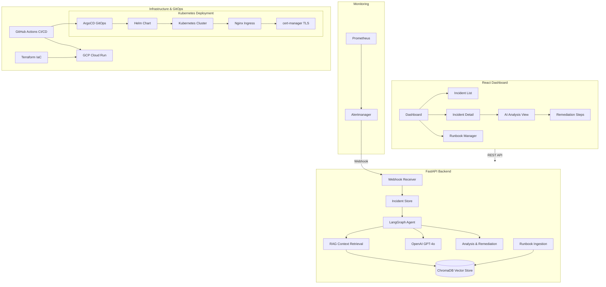

# AI Infrastructure Incident Responder

An AI-powered incident response system that receives Prometheus/Alertmanager webhook alerts, uses **LangGraph** agents with **RAG** (LangChain + ChromaDB) to search runbooks for matching remediation steps, and provides actionable fix suggestions through a real-time dashboard.

## Architecture



## Features

- **Alertmanager Webhook Integration** -- Receives and processes Prometheus alerts in real-time
- **LangGraph AI Agent** -- Multi-step reasoning pipeline: context retrieval, analysis, and remediation planning
- **RAG-Powered Runbook Search** -- Ingests organizational runbooks into ChromaDB for semantic search
- **AI-Generated Remediation** -- Provides root cause analysis, step-by-step remediation with commands, confidence scores, and impact assessment
- **React Dashboard** -- Real-time incident monitoring with stats, AI analysis panel, and runbook management
- **Kubernetes Deployment** -- Production-grade manifests with Deployments, Services, Ingress, HPA, PDB, and NetworkPolicy
- **Helm Chart** -- Fully parameterized Helm chart for customizable, repeatable deployments across environments
- **ArgoCD GitOps** -- Multi-environment (dev/staging/prod) ApplicationSet with automated sync, self-healing, and pruning
- **Production Infrastructure** -- Dockerized, CI/CD with GitHub Actions, Terraform for GCP Cloud Run, and Kubernetes-native deployment

## Tech Stack

| Layer | Technology |
|-------|-----------|
| AI Agent | LangGraph, LangChain |
| LLM | OpenAI GPT-4o-mini |
| Vector Store | ChromaDB |
| Backend | FastAPI, Python 3.12 |
| Frontend | React 18, TypeScript, Tailwind CSS |
| Containers | Docker, Docker Compose |
| Orchestration | Kubernetes, Helm 3 |
| GitOps | ArgoCD (ApplicationSet) |
| Ingress & TLS | Nginx Ingress Controller, cert-manager |
| Infrastructure | Terraform, GitHub Actions |
| Cloud | GCP Cloud Run, Secret Manager |

## Quick Start

### Prerequisites
- Docker & Docker Compose
- OpenAI API key

### Run Locally

```bash
# Clone the repository
git clone https://github.com/MohamedGouda99/ai-incident-responder.git
cd ai-incident-responder

# Configure environment
cp .env.example .env
# Edit .env and add your OPENAI_API_KEY

# Start all services
docker-compose up --build
```

The application will be available at:
- **Frontend**: http://localhost:3000
- **Backend API**: http://localhost:8000
- **API Docs**: http://localhost:8000/docs

### Send a Test Alert

Click the **"Test Alert"** button in the dashboard, or send a manual webhook:

```bash
curl -X POST http://localhost:8000/api/v1/webhook/alertmanager \
  -H "Content-Type: application/json" \
  -d '{
    "version": "4",
    "status": "firing",
    "alerts": [{
      "status": "firing",
      "labels": {
        "alertname": "HighCPUUsage",
        "instance": "web-server-01:9090",
        "severity": "critical"
      },
      "annotations": {
        "summary": "CPU usage above 90% for 5 minutes"
      }
    }]
  }'
```

### Upload a Runbook

```bash
curl -X POST http://localhost:8000/api/v1/runbooks \
  -H "Content-Type: application/json" \
  -d '{
    "title": "High CPU Usage Runbook",
    "content": "## When CPU > 90%\n1. Check top processes\n2. Scale horizontally\n3. Review recent deployments",
    "category": "infrastructure",
    "tags": ["cpu", "performance"]
  }'
```

## Deployment

### GCP Cloud Run with Terraform

```bash
cd terraform

# Configure variables
cp terraform.tfvars.example terraform.tfvars
# Edit terraform.tfvars with your GCP project details

# Deploy
terraform init
terraform plan
terraform apply
```

### CI/CD with GitHub Actions

The pipeline automatically:
1. Lints and type-checks both backend and frontend
2. Builds Docker images and pushes to GCR
3. Deploys to Cloud Run on push to `main`

Required GitHub Secrets:
- `GCP_PROJECT_ID` -- Your GCP project ID
- `GCP_SA_KEY` -- Service account key JSON
- `OPENAI_API_KEY` -- OpenAI API key

---

### Kubernetes Deployment

Deploy directly to a Kubernetes cluster using the raw manifests in `k8s/`. This approach is suitable for quick deployments or clusters without Helm.

**Prerequisites:**
- A running Kubernetes cluster (v1.24+)
- `kubectl` configured with cluster access
- Nginx Ingress Controller installed
- cert-manager installed (for TLS)

```bash
# Create the namespace
kubectl apply -f k8s/namespace.yaml

# Deploy backend (ConfigMap, Secret, Deployment, Service, HPA)
kubectl apply -f k8s/backend/

# Deploy frontend (Deployment, Service)
kubectl apply -f k8s/frontend/

# Apply Ingress, NetworkPolicy, and PodDisruptionBudget
kubectl apply -f k8s/ingress.yaml
kubectl apply -f k8s/network-policy.yaml
kubectl apply -f k8s/pdb.yaml
```

Before deploying, edit the Secret in `k8s/backend/secret.yaml` with your base64-encoded `OPENAI_API_KEY`:

```bash
echo -n "your-api-key" | base64
```

Verify the deployment:

```bash
kubectl get pods -n incident-responder
kubectl get svc -n incident-responder
kubectl get ingress -n incident-responder
```

---

### Helm Chart

The Helm chart in `helm/incident-responder/` provides a fully parameterized deployment with configurable replicas, resources, autoscaling, ingress, network policies, and security contexts.

**Prerequisites:**
- Helm 3.x installed
- Kubernetes cluster with Nginx Ingress Controller and cert-manager

**Install with default values:**

```bash
helm install incident-responder ./helm/incident-responder \
  --namespace incident-responder \
  --create-namespace
```

**Install with custom values:**

```bash
helm install incident-responder ./helm/incident-responder \
  --namespace incident-responder \
  --create-namespace \
  -f my-values.yaml
```

**Key values to configure** (`values.yaml`):

| Parameter | Description | Default |
|-----------|-------------|---------|
| `backend.image.tag` | Backend image tag | `latest` |
| `backend.secrets.OPENAI_API_KEY` | OpenAI API key | `change-me-to-your-actual-key` |
| `backend.config.OPENAI_MODEL` | OpenAI model to use | `gpt-4` |
| `backend.autoscaling.enabled` | Enable HPA for backend | `true` |
| `backend.autoscaling.minReplicas` | Minimum backend replicas | `2` |
| `backend.autoscaling.maxReplicas` | Maximum backend replicas | `10` |
| `frontend.replicaCount` | Frontend replicas | `2` |
| `ingress.enabled` | Enable Ingress resource | `true` |
| `ingress.host` | Ingress hostname | `incident-responder.example.com` |
| `ingress.tls.enabled` | Enable TLS via cert-manager | `true` |
| `networkPolicy.enabled` | Enable NetworkPolicy | `true` |

**Upgrade an existing release:**

```bash
helm upgrade incident-responder ./helm/incident-responder \
  --namespace incident-responder \
  -f my-values.yaml
```

**Uninstall:**

```bash
helm uninstall incident-responder --namespace incident-responder
```

---

### ArgoCD GitOps

The `argocd/` directory contains a complete GitOps setup with multi-environment support using ArgoCD ApplicationSet.

**Components:**

| File | Purpose |
|------|---------|
| `argocd/project.yaml` | AppProject with RBAC, scoped to allowed namespaces and resource types |
| `argocd/application.yaml` | Single Application targeting `main` branch for production |
| `argocd/applicationset.yaml` | ApplicationSet generating apps for dev, staging, and prod |
| `argocd/overlays/dev/values.yaml` | Dev overrides: single replica, debug logging, no TLS |
| `argocd/overlays/staging/values.yaml` | Staging overrides: moderate resources, TLS enabled |
| `argocd/overlays/prod/values.yaml` | Prod overrides: 3+ replicas, HPA, strict security, rate limiting |

**Environment mapping:**

| Environment | Git Branch | Namespace | Sync Policy |
|-------------|-----------|-----------|-------------|
| dev | `develop` | `incident-responder-dev` | Automated, self-heal, prune |
| staging | `staging` | `incident-responder-staging` | Automated, self-heal, prune |
| prod | `main` | `incident-responder-prod` | Automated, self-heal, prune |

**Setup:**

```bash
# 1. Install the ArgoCD project (scoped RBAC and allowed resources)
kubectl apply -f argocd/project.yaml

# 2. Option A: Deploy a single production Application
kubectl apply -f argocd/application.yaml

# 2. Option B: Deploy all environments with ApplicationSet
kubectl apply -f argocd/applicationset.yaml
```

Once applied, ArgoCD will:
- Automatically sync the Helm chart from the configured Git branch
- Apply environment-specific value overrides from `argocd/overlays/<env>/values.yaml`
- Self-heal if any drift is detected in the cluster
- Prune resources that are removed from Git
- Retry failed syncs up to 5 times with exponential backoff
- Send Slack notifications on sync success or failure

---

## Project Structure

```
├── backend/
│   ├── app/
│   │   ├── agents/              # LangGraph incident analysis agent
│   │   ├── api/                 # FastAPI route handlers
│   │   ├── core/                # Configuration and logging
│   │   ├── models/              # Pydantic schemas
│   │   └── services/            # Vector store, incident store, seeder
│   ├── runbooks/                # Sample runbook documents
│   ├── Dockerfile
│   └── requirements.txt
├── frontend/
│   ├── src/
│   │   ├── components/          # React UI components
│   │   ├── hooks/               # Custom React hooks
│   │   ├── lib/                 # API client
│   │   └── types/               # TypeScript type definitions
│   ├── Dockerfile
│   └── nginx.conf
├── k8s/                         # Raw Kubernetes manifests
│   ├── namespace.yaml           # Namespace definition
│   ├── backend/
│   │   ├── configmap.yaml       # Backend configuration
│   │   ├── secret.yaml          # API keys (base64-encoded)
│   │   ├── deployment.yaml      # Backend Deployment
│   │   ├── service.yaml         # Backend ClusterIP Service
│   │   └── hpa.yaml             # Horizontal Pod Autoscaler
│   ├── frontend/
│   │   ├── deployment.yaml      # Frontend Deployment
│   │   └── service.yaml         # Frontend ClusterIP Service
│   ├── ingress.yaml             # Nginx Ingress with TLS
│   ├── network-policy.yaml      # Pod-to-pod traffic rules
│   └── pdb.yaml                 # Pod Disruption Budgets
├── helm/
│   └── incident-responder/      # Helm chart
│       ├── Chart.yaml           # Chart metadata (v1.0.0)
│       ├── values.yaml          # Default values
│       └── templates/           # Kubernetes resource templates
│           ├── _helpers.tpl
│           ├── namespace.yaml
│           ├── serviceaccount.yaml
│           ├── backend-configmap.yaml
│           ├── backend-secret.yaml
│           ├── backend-deployment.yaml
│           ├── backend-service.yaml
│           ├── backend-hpa.yaml
│           ├── frontend-deployment.yaml
│           ├── frontend-service.yaml
│           ├── ingress.yaml
│           ├── network-policy.yaml
│           └── NOTES.txt
├── argocd/                      # ArgoCD GitOps configuration
│   ├── project.yaml             # AppProject with RBAC
│   ├── application.yaml         # Single-env Application (prod)
│   ├── applicationset.yaml      # Multi-env ApplicationSet
│   └── overlays/                # Per-environment value overrides
│       ├── dev/values.yaml
│       ├── staging/values.yaml
│       └── prod/values.yaml
├── terraform/                   # GCP Cloud Run infrastructure
├── .github/workflows/           # CI/CD pipeline
├── docker-compose.yml
└── .env.example
```

## Screenshots

> Screenshots will be added after initial deployment.

## License

MIT
