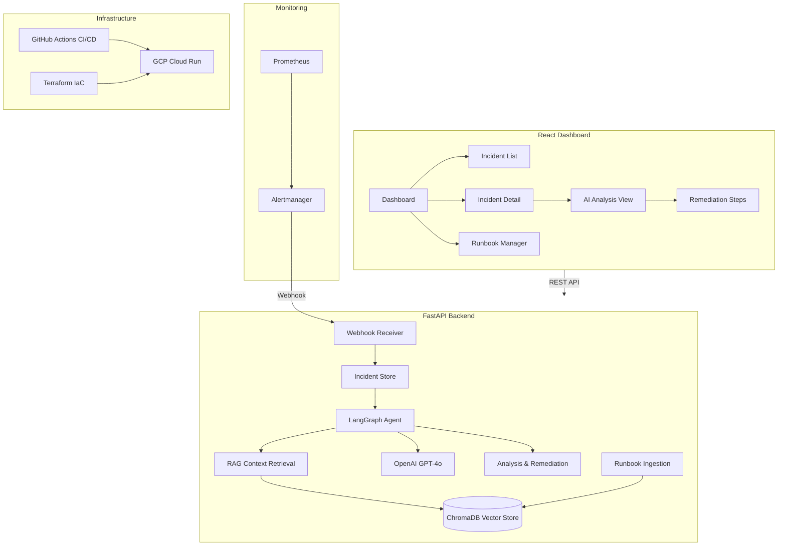

# AI Infrastructure Incident Responder

An AI-powered incident response system that receives Prometheus/Alertmanager webhook alerts, uses **LangGraph** agents with **RAG** (LangChain + ChromaDB) to search runbooks for matching remediation steps, and provides actionable fix suggestions through a real-time dashboard.

## Architecture



## Features

- **Alertmanager Webhook Integration** — Receives and processes Prometheus alerts in real-time
- **LangGraph AI Agent** — Multi-step reasoning pipeline: context retrieval → analysis → remediation planning
- **RAG-Powered Runbook Search** — Ingests organizational runbooks into ChromaDB for semantic search
- **AI-Generated Remediation** — Provides root cause analysis, step-by-step remediation with commands, confidence scores, and impact assessment
- **React Dashboard** — Real-time incident monitoring with stats, AI analysis panel, and runbook management
- **Production Infrastructure** — Dockerized, CI/CD with GitHub Actions, Terraform for GCP Cloud Run deployment

## Tech Stack

| Layer | Technology |
|-------|-----------|
| AI Agent | LangGraph, LangChain |
| LLM | OpenAI GPT-4o-mini |
| Vector Store | ChromaDB |
| Backend | FastAPI, Python 3.12 |
| Frontend | React 18, TypeScript, Tailwind CSS |
| Infrastructure | Docker, GitHub Actions, Terraform |
| Cloud | GCP Cloud Run, Secret Manager |

## Quick Start

### Prerequisites
- Docker & Docker Compose
- OpenAI API key

### Run Locally

```bash
# Clone the repository
git clone https://github.com/MohamedGouda99/ai-incident-responder.git
cd ai-incident-responder

# Configure environment
cp .env.example .env
# Edit .env and add your OPENAI_API_KEY

# Start all services
docker-compose up --build
```

The application will be available at:
- **Frontend**: http://localhost:3000
- **Backend API**: http://localhost:8000
- **API Docs**: http://localhost:8000/docs

### Send a Test Alert

Click the **"Test Alert"** button in the dashboard, or send a manual webhook:

```bash
curl -X POST http://localhost:8000/api/v1/webhook/alertmanager \
  -H "Content-Type: application/json" \
  -d '{
    "version": "4",
    "status": "firing",
    "alerts": [{
      "status": "firing",
      "labels": {
        "alertname": "HighCPUUsage",
        "instance": "web-server-01:9090",
        "severity": "critical"
      },
      "annotations": {
        "summary": "CPU usage above 90% for 5 minutes"
      }
    }]
  }'
```

### Upload a Runbook

```bash
curl -X POST http://localhost:8000/api/v1/runbooks \
  -H "Content-Type: application/json" \
  -d '{
    "title": "High CPU Usage Runbook",
    "content": "## When CPU > 90%\n1. Check top processes\n2. Scale horizontally\n3. Review recent deployments",
    "category": "infrastructure",
    "tags": ["cpu", "performance"]
  }'
```

## Deployment

### GCP Cloud Run with Terraform

```bash
cd terraform

# Configure variables
cp terraform.tfvars.example terraform.tfvars
# Edit terraform.tfvars with your GCP project details

# Deploy
terraform init
terraform plan
terraform apply
```

### CI/CD with GitHub Actions

The pipeline automatically:
1. Lints and type-checks both backend and frontend
2. Builds Docker images and pushes to GCR
3. Deploys to Cloud Run on push to `main`

Required GitHub Secrets:
- `GCP_PROJECT_ID` — Your GCP project ID
- `GCP_SA_KEY` — Service account key JSON
- `OPENAI_API_KEY` — OpenAI API key

## Project Structure

```
├── backend/
│   ├── app/
│   │   ├── agents/          # LangGraph incident analysis agent
│   │   ├── api/             # FastAPI route handlers
│   │   ├── core/            # Configuration and logging
│   │   ├── models/          # Pydantic schemas
│   │   └── services/        # Vector store, incident store, seeder
│   ├── runbooks/            # Sample runbook documents
│   ├── Dockerfile
│   └── requirements.txt
├── frontend/
│   ├── src/
│   │   ├── components/      # React UI components
│   │   ├── hooks/           # Custom React hooks
│   │   ├── lib/             # API client
│   │   └── types/           # TypeScript type definitions
│   ├── Dockerfile
│   └── nginx.conf
├── terraform/               # GCP Cloud Run infrastructure
├── .github/workflows/       # CI/CD pipeline
├── docker-compose.yml
└── .env.example
```

## Screenshots

> Screenshots will be added after initial deployment.

## License

MIT
